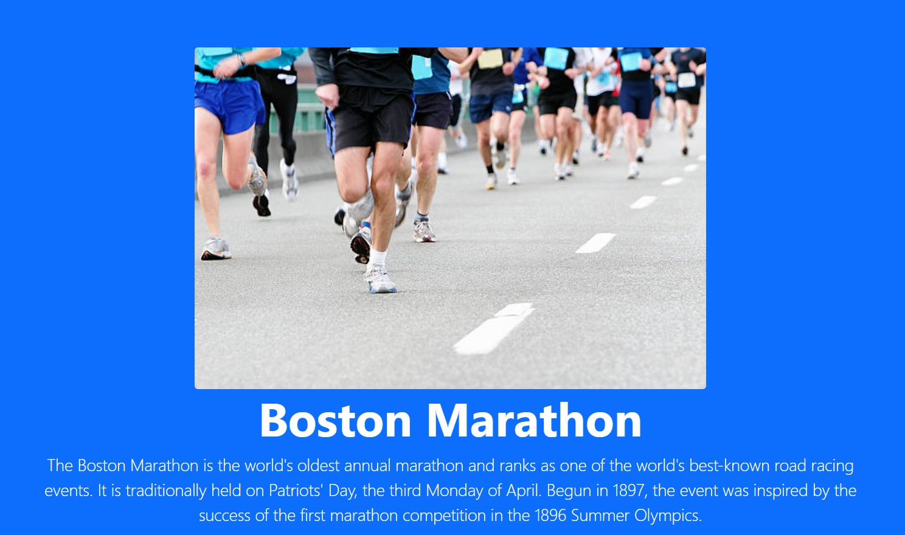
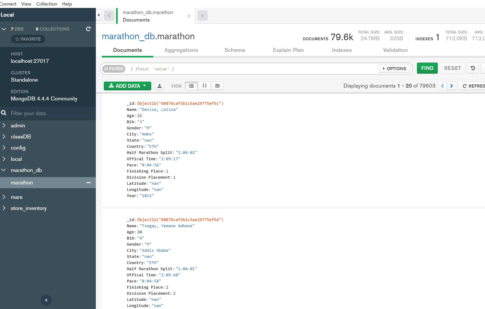
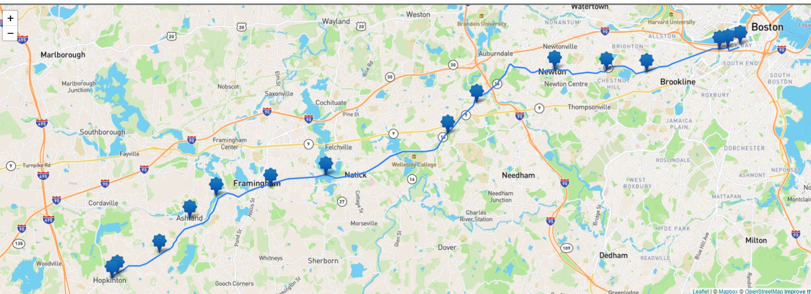

# Meadows Unlimited
## Boston Marathon Visualization Project


## Team Members
* Chelsea Chaussee
* Sandy Goodell
* Chia Sun
pytho
## Our Project Utilizes

* Python Flask - powered API
* HTML/CSS
* Javascript
* MongoDB



## Our Data

Our website features visualizations that update from Python Flask API calls that uses csv files that have been ETL'd into our MongoDB. CSV files from Kaggle dataset 
[Finishers Boston Marathon 2015, 2016 & 2017](https://www.kaggle.com/rojour/boston-results).

The data has the names, time and general demographics of the finishers.

## Cleaning Dataset

We started with data that was robust in data fields and lengthy. 
Using jupyternotebook we removed some unnamed columns. We added a year column. Compared each columns on each CSV file. Latitude and longitudes were added to the CSV files using Excel for US states.

Below is some of the code from jupyternotebook storing merged csv files.

```
data = []
for index, row in merged_df.iterrows():
    post={
        'Name' : str(row["Name"]),
        'Age' : int(row["Age"]),
        'Bib' : str(row["Bib"]),
        'Gender': str(row["M/F"]),
        'City': str(row["City"]),
        'State': str(row["State"]),
        'Country' : str(row["Country"]),
        'Half Marathon Split' : str(row["Half"]),
        'Offical Time' : str(row["Official Time"]),
        'Pace': str(row["Pace"]),
        'Finishing Place': int(row["Overall"]),
        'Division Placement' : int(row["Division"]),
        'Latitude' : str(row["lat"]),
        'Longitude' : str(row["long"]),
        'Year' : str(row["Year"])}
    data.append(post)

```


# Instructions:
## How to Intall Data into mongoDB
*  From Kaggle.com download dataset (https://www.kaggle.com/rojour/boston-results) It is 3 csv files.
*  Import pymongo and pandas as pd
* Creat connection to mongoDB
  - conn = "mongodb://localhost:27017"
  - client = pymongo.MongoClient(conn)
* Create database to store data
  - db = client.marathon_db
* Create variables for csv files
  - marathon15_file = "your path for 2015 data"
  - marathon16_file = "your path for 2016 data"
  - marathon17_file = "your path for 2017 data"
* Have pandas read csv files
  - Look at data and drop any unnamed columns
* Merge all datasets into one file 
  - That way all data is in one collection
* Choose columns to store in database
  - We chose: Name, Age, Bib, Gender, City, State, Country, Half Marathon Split, Official Time, Pace, Finishing Place, Division Placement, Latitude, Longitude, Year
* Insert data into database
  - db.marathon.insert_many(data)

## Our Visualizations
Our data lead us to create visualizations around and about the Boston Marathon. Specifically, the years of 2015, 2016, and 2017. 

Since the Boston Marathon is the oldest marathon run in the US and it is the only marathon that most of the participants have to qualify to participate.
<br />  
<br />  


### Visualization 1
We have assembled a visualization that will provide the user the ability to learn information about the route of the Marathon and the specific location for the best views of the race itself. The route is historic in it's origin and development over the years. The course starts in town of Hopkinton on Main Street. Then travels along the Route 135 where the course then moves through the towns of Ashland, Framinham, Natick and Wellesley. Once the course reaches Wellesley, the path then diverges onto Route 16. 
https://gist.github.com/jwass/11119254#file-boston_marathon-geojson


<br />  
<br />  

### Visualization 2
This scatter plot shows (use the toggle buttons to switch through 2015, 2016 and 2017) the runners who finished the Boston Marathon by official finishing time.This chart is visualizing age and finish time by gender, showing there is not a trend of men slowing down differently as they age than women.


<br />  
<br />  

### Visualization 3

Our last scatter plot shows the various sampled countries that individuals registered to run under in the years 2015, 2016 and 2017 races. This plot shows the runners time in total minutes versus their age. One of the interesting things that you can see from this graph is the marathon is highly popular no matter the age range. The oldest age of a person who ran this marathon in this time frame was: 2015 - 82 yrs old, 2016 -83 yrs old, and 2017 - 84 yrs old.


